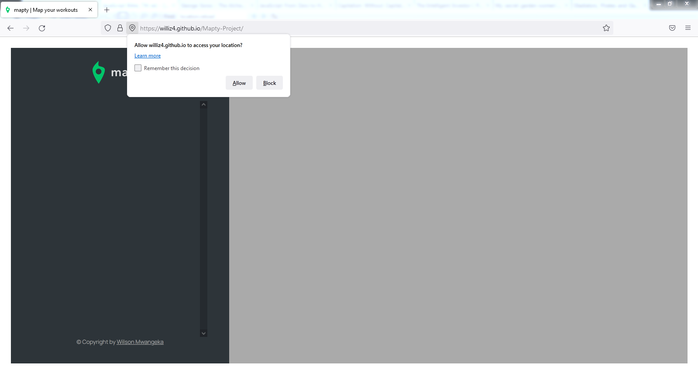

# Mapty

#### Bookmark Keeper, 9th March 2022

#### By Wilson Mwangeka

## Description

Mapty is a web app that allows you to be able to log your workouts. Currently Mapty allows you to log 2 workout activities which are the Running and Cycling workouts. You are able to log the location of the workout and the date too. Mapty also uses the localStorage Api to ensure that previous workouts are available to you when you return to the page.

## How To Interact with the Application
* The site is located at the url https://williz4.github.io/Mapty-Project/

* At first load the site and you will get a prompt that asks you for your current location. Accept the prompt to enable the application to get your current location.

* After the application has your current location. It will load the map from a 3rd party library (Leaflet.js), based on your current location.

* Once you click on any location on the map the app shall fetch the latitude and longitude coordinates and display a from that enables you to enter the type of workout (Running or Cycling).

* After entering all the relevant data make sure you submit it.

* After submitting the data. The workout is logged on the map as a marker and also on the side bar with its description.

## Known  Bugs
Currently there are no known bugs in Mapty apart from when we lose the protoypal chain when working with OOP and localStorage.

## Technologies Used
I used HTML for the sites structure and CSS for the styling and visual presentation and finally Modern JS concepts (ES6 classes, private fields among others).

## Support and Contact Details
Incase of any question or feedback feel free to reach out to me on my personal email @wilsonmwangeka8@gmail.com

### License

*MIT License*
Copyright (c) 2022 